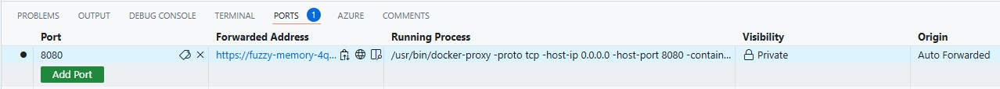

# Containerization

1. Use the following prompt to create the dockerfile using copilot

    ```
    @workspace create a dockerfile for building and running the application. Use different stages for the build and runtime. Use an alpine base image for the runtime. Install the icu-libs
    tiff, libgdiplus, libc-dev, tzdata packages. Set the globalization invariant mode to false. Add the ASPNETCORE_URLS env variable for port 8080 and expose that port from the container.
    ```

    The resulting dockerfile should be 
    ```
    # Stage 1: Build
    FROM mcr.microsoft.com/dotnet/sdk:9.0 AS build
    WORKDIR /source

    # Copy the project files and restore dependencies
    COPY *.sln .
    COPY AdventureWorks.Web.csproj .
    RUN dotnet restore AdventureWorks.Web.csproj

    # Copy the rest of the source code and build the application
    COPY . .
    RUN dotnet publish AdventureWorks.Web.csproj -c Release -o /app

    # Stage 2: Runtime
    FROM mcr.microsoft.com/dotnet/aspnet:9.0-alpine AS runtime
    WORKDIR /app

    # Install required packages
    RUN apk add --no-cache \
        tiff \
        libgdiplus

    # Set the globalization invariant mode to false
    ENV DOTNET_SYSTEM_GLOBALIZATION_INVARIANT=false

    # Set the ASPNETCORE_URLS environment variable
    ENV ASPNETCORE_URLS=http://+:8080

    # Copy the built application from the build stage
    COPY --from=build /app .

    # Expose port 8080
    EXPOSE 8080

    # Run the application
    ENTRYPOINT ["dotnet", "AdventureWorks.Web.dll"]
    ```

2. Build the container image using the dockerfile
    ```
    docker build -t adventureworks-web .
    ```
    Check if the image has been built correctly by running 
    ```
    docker images
    ```

3. Run the container image
    ```
    docker run -d -p 8080:8080 --name adventureworks-web adventureworks-web
    ```
    the container should be running and a tunnel should be created pointing to the running container instance
    use that port to run the application in the browser
    

    >**NOTE** The application will throw an exception as there's no database connectivity yet. That's expected.
    

    ```
    docker run -d -p 8080:8080 --name adventureworks-web -e ConnectionStrings__sampledbContext="Server=tcp:kpdbserver.database.windows.net,1433;Initial Catalog=advworks;Persist Security Info=False;User ID=sqladmin;Password={PASSWORD};MultipleActiveResultSets=False;Encrypt=True;TrustServerCertificate=False;Connection Timeout=30;" adventureworks-web
    ```
