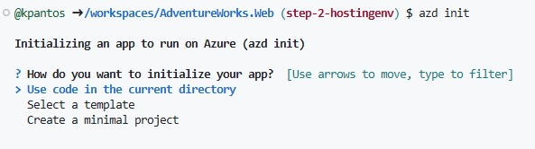
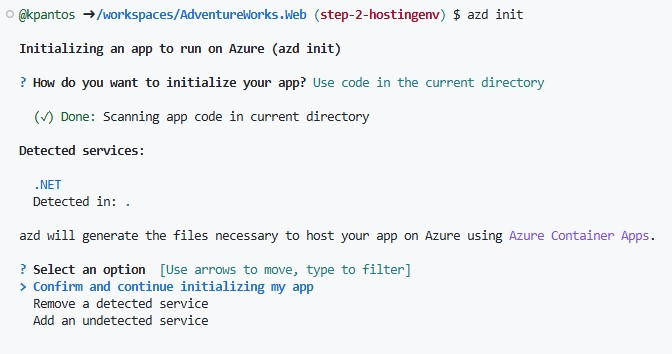
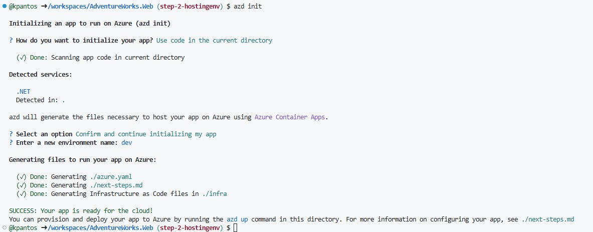
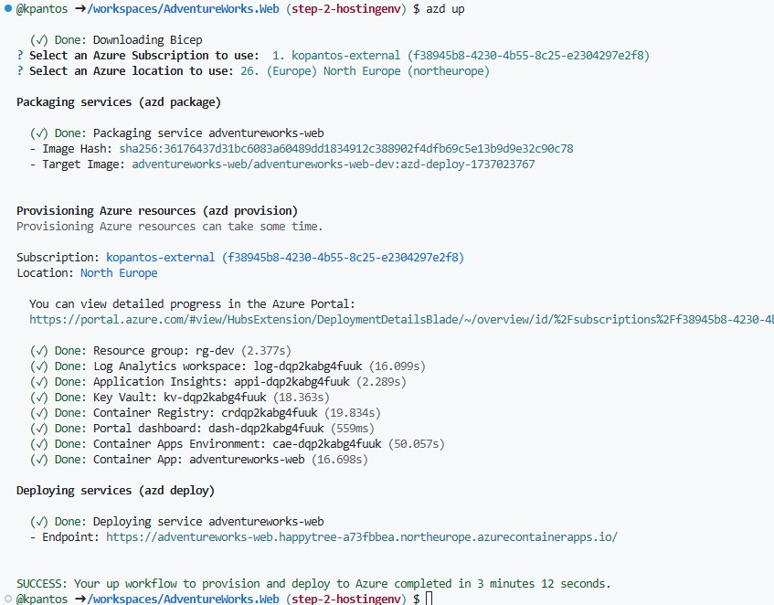

# Initial deployment

1. Login to Azure tenant using AZD

```
azd auth login --tenant-id 5c632e18-3086-4bad-938e-5144bc5c69bc
```

>**OPTIONAL** Login to Azure tenant using az cli ```az login --tenant 5c632e18-3086-4bad-938e-5144bc5c69bc```

2. Run ```azd init``` to initialize select use code in current directory.


azd will scan the current directory to find the right azure target hosting environment to deploy the application.


once the scan is complete azd will generate the artifacts required to deploy your application to azure.


3. Test out the deployment by running the ``azd up`` command


Once the deployment has finished navigate to Azure and demonstrate the resources that have been deployed for the application.


  >**NOTE** The application will throw an exception as there's no database connectivity yet. That's expected.
    

4. Navigate to the deployed container app and add a secret for the database connection string

```
Server=tcp:kpdbserver.database.windows.net,1433;Initial Catalog=advworks;Persist Security Info=False;User ID=sqladmin;Password=<<PASSWORD>>;MultipleActiveResultSets=False;Encrypt=True;TrustServerCertificate=False;Connection Timeout=30;
```


6. Next navigate to containers and click edit and deploy in order to create a new environment variable and link it to the secret already created


once the new revision is up and running the application should load up.

# Configure CI/CD using azd
1. Run ``azd pipeline config`` to create a CI/CD pipeline for deploying the application.
 
