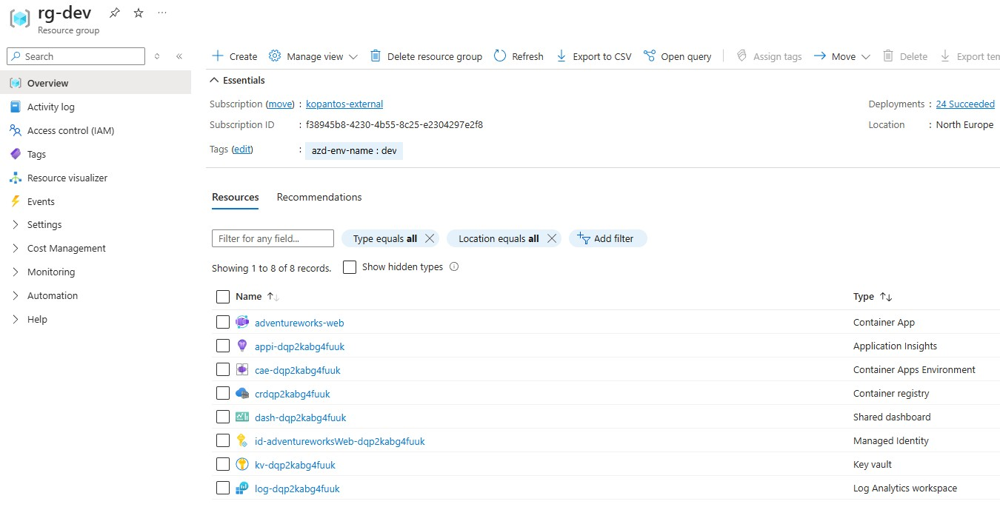
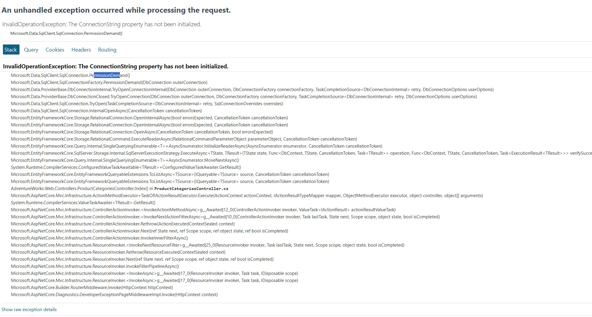
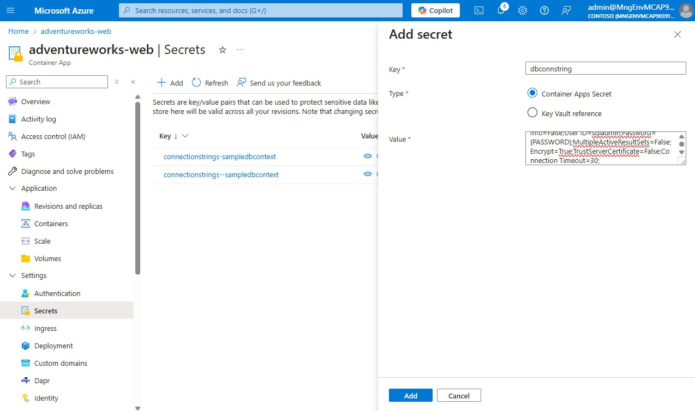
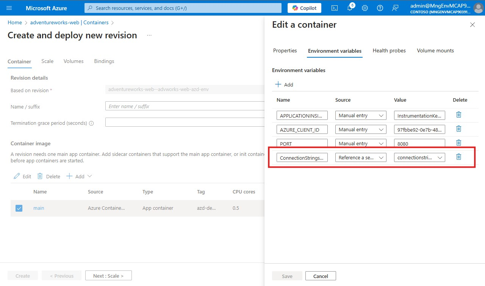
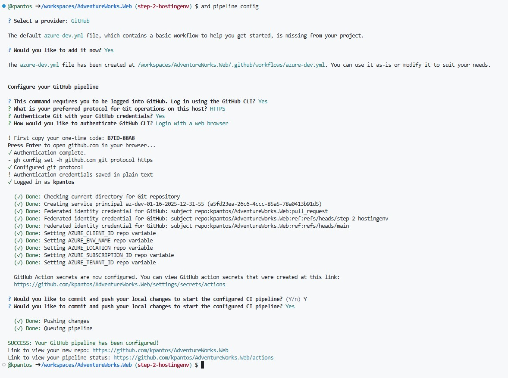

# Initial deployment

1. Login to Azure tenant using AZD

    ```
    azd auth login --tenant-id 5c632e18-3086-4bad-938e-5144bc5c69bc
    ```

    >**OPTIONAL** Login to Azure tenant using az cli ```az login --tenant 5c632e18-3086-4bad-938e-5144bc5c69bc```

2. Run ```azd init``` to initialize select use code in current directory.

    azd will scan the current directory to find the right azure target hosting environment to deploy the application.
    once the scan is complete azd will generate the artifacts required to deploy your application to azure.


    > **IMPORTANT**
    > Make sure you specified the correct project at the `azure.yaml` file as the folder app contains 2 both the solution as well as the csproj files. The azure.yaml should look like this:

      ```
      # yaml-language-server: $schema=https://raw.githubusercontent.com/Azure/azure-dev/main/schemas/v1.0/azure.yaml.json

      name: migrating-apps-to-azure
      metadata:
          template: azd-init@1.15.1
      services:
          app:
              project: app/AdventureWorks.Web.csproj
              host: containerapp
              language: dotnet
              build:
                  dockerfile: dockerfile
                  context: .
      ```
    > Make sure that the app resource at the```resources.bicep``` file contains the `ASPNETCORE_URLS` Environment Variable. Update the `env` section in your Bicep file to include the `ASPNETCORE_URLS` environment variable:

    ```bicep
    env: [
      {
        name: 'APPLICATIONINSIGHTS_CONNECTION_STRING'
        value: monitoring.outputs.applicationInsightsConnectionString
      }
      {
        name: 'AZURE_CLIENT_ID'
        value: appIdentity.outputs.clientId
      }
      {
        name: 'PORT'
        value: '8080'
      }
      {
        name: 'ASPNETCORE_URLS'
        value: 'http://0.0.0.0:8080'
      }
    ]
    ```

    This ensures that the application listens on port `8080` as required by the `ingressTargetPort`.


3. Test out the deployment by running the ```azd up``` command

    Once the deployment has finished navigate to Azure and demonstrate the resources that have been deployed for the application.
    

      >**NOTE** The application will throw an exception as there's no database connectivity yet. That's expected.
        

4. Navigate to the deployed container app and add a secret for the database connection string

    ```
    Server=tcp:kpdbserver.database.windows.net,1433;Initial Catalog=advworks;Persist Security Info=False;User ID=sqladmin;Password=<<PASSWORD>>;MultipleActiveResultSets=False;Encrypt=True;TrustServerCertificate=False;Connection Timeout=30;
    ```

    

6. Next navigate to containers and click edit and deploy in order to create a new environment variable named ```ConnectionStrings__sampledbContext``` and link it to the secret already created
    

    once the new revision is up and running the application should load up.

# Configure CI/CD using azd
1. Run ``azd pipeline config`` to create a CI/CD pipeline for deploying the application.
     
