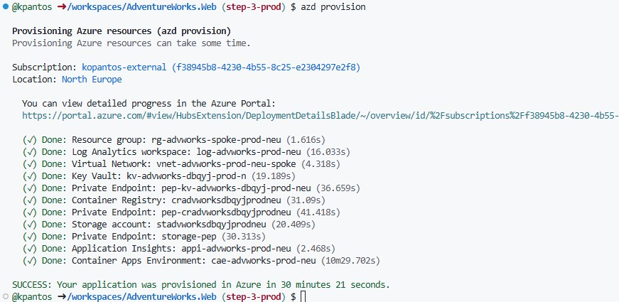

### Production Environment
1. Start by deleting all the bicep files under infra folder leaving just the main.bicep one.

2. At the main.bicep replace all the content with

    ```bicep
    targetScope = 'subscription'

    param location string = 'northeurope'
    @secure()
    param password string

    module hostingEnvironment 'br/public:avm/ptn/aca-lza/hosting-environment:0.2.0' = {
      name: 'hostingEnvironmentDeployment'
      params: {
        // Required parameters
        applicationGatewayCertificateKeyName: 'appgwcert'
        deploymentSubnetAddressPrefix: '10.1.4.0/24'
        enableApplicationInsights: true
        enableDaprInstrumentation: false
        spokeApplicationGatewaySubnetAddressPrefix: '10.1.3.0/24'
        spokeInfraSubnetAddressPrefix: '10.1.0.0/23'
        spokePrivateEndpointsSubnetAddressPrefix: '10.1.2.0/27'
        spokeVNetAddressPrefixes: [
          '10.1.0.0/21'
        ]
        vmAdminPassword: password
        vmJumpBoxSubnetAddressPrefix: '10.1.2.32/27'
        vmSize: 'Standard_B1s'
        // Non-required parameters
        deployZoneRedundantResources: true
        enableDdosProtection: true
        environment: 'prod'
        exposeContainerAppsWith: 'applicationGateway'
        location: location
        storageAccountType: 'Premium_LRS'
        tags: {
          environment: 'test'
        }
        vmAuthenticationType: 'sshPublicKey'
        vmJumpboxOSType: 'linux'
        workloadName: 'advworks'
      }
    }

    output AZURE_CONTAINERAPPSENV_RESOURCE_ID string = hostingEnvironment.outputs.containerAppsEnvironmentResourceId
    output AZURE_CONTAINERREGISTRY_RESOURCE_ID string = hostingEnvironment.outputs.containerRegistryResourceId
    output AZURE_KEYVAULT_RESOURCE_ID string = hostingEnvironment.outputs.keyVaultResourceId

    ```

3. Create a new azd env by running `azd env new` and provide a name for it (e.g. prod)

4. Select the defaut environment to use with azd by issueing `azd env select <name>`

5. Provision the production environment by running `azd provision`

    


### Hosted runner deployment
In order to be able to deploy the application in the new production environment we need to run from within the virtual network so that the container registry is accessible and can push new image builds.
To do this we can deploy a job app at the existing container apps environment to run the gh pipelines.

1. Add the following piece of code to the `main.bicep` file

    ```
    module hostedRunner 'br/public:avm/res/app/job:0.5.2' = {
      name: 'hostedRunnerDeployment'
      scope: resourceGroup('rg-advworks-spoke-prod-neu')
      params: {
        name: 'hosted-runner-job'
        location: location
        tags: {
          environment: 'prod'
        }
        environmentResourceId: hostingEnvironment.outputs.containerAppsEnvironmentResourceId
        workloadProfileName: 'general-purpose'
        triggerType: 'Event'
        replicaTimeout: 1800
        replicaRetryLimit: 0
        secrets: [
          {
            name: 'personal-access-token'
            value: githubpat
          }
        ]
        eventTriggerConfig: {
          parallelism: 1
          replicaCompletionCount: 1
          scale: {
            minExecutions: 0
            maxExecutions: 10
            pollingInterval: 30
            rules: [
              {
                name: 'github-runner'
                type: 'github-runner'
                metadata: {
                  githubAPIURL: 'https://api.github.com'
                  owner: 'kpantos'
                  runnerScope : 'repo'
                  repos: 'AdventureWorks.Web'
                  targetWorkflowQueueLength: '1'
                }
                auth: [
                  {
                    secretRef: 'personal-access-token'
                    triggerParameter: 'personalAccessToken'
                  }
                ]
              }
            ]
          }
        }
        containers: [
          {
            name: 'hosted-runner-job'
            image: 'docker.io/kpantos/github-actions-runner:1.5'
            resources: {
              cpu: '2.0'
              memory: '4Gi'
            }
            env: [
              {
                name: 'GITHUB_PAT'
                secretRef: 'personal-access-token'
              }
              {
                name: 'GH_URL'
                value: 'https://github.com/kpantos/AdventureWorks.Web'
              }
              {
                name: 'REGISTRATION_TOKEN_API_URL'
                value: 'https://api.github.com/repos/kpantos/AdventureWorks.Web/actions/runners/registration-token'
              }
            ]
          }
        ]
      }
    }
    ```
    this requires a GitHub personal access token parameter which need to be added at the bicep file. azd will ask for a value next time the `azd provision` command is issued.

    >**NOTE** Don't forget to run azd pipeline config to update github state with the cuurent parameter values.

2. Split the `azure-dev.yml` pipeline into 2 parts one for provisioning the infrastructure and one for deploying the application.
Name the one used for deploying the application `azure-app.yml` and copy the environment setting from the original pipeline.
The 2 file should look like:

    **`azure-dev.yml`**
    ```yml
    # Run when commits are pushed to step-2-hostingenv
    on:
      workflow_dispatch:

    # Set up permissions for deploying with secretless Azure federated credentials
    # https://learn.microsoft.com/en-us/azure/developer/github/connect-from-azure?tabs=azure-portal%2Clinux#set-up-azure-login-with-openid-connect-authentication
    permissions:
      id-token: write
      contents: read


    jobs:
      build:
        runs-on: ubuntu-latest
        env:
          AZURE_CLIENT_ID: ${{ vars.AZURE_CLIENT_ID }}
          AZURE_TENANT_ID: ${{ vars.AZURE_TENANT_ID }}
          AZURE_SUBSCRIPTION_ID: ${{ vars.AZURE_SUBSCRIPTION_ID }}
          AZURE_ENV_NAME: ${{ vars.AZURE_ENV_NAME }}
          AZURE_LOCATION: ${{ vars.AZURE_LOCATION }}
        steps:
          - name: Checkout
            uses: actions/checkout@v4
          - name: Install azd
            uses: Azure/setup-azd@v2
          - name: Log in with Azure (Federated Credentials)
            run: |
              azd auth login `
                --client-id "$Env:AZURE_CLIENT_ID" `
                --federated-credential-provider "github" `
                --tenant-id "$Env:AZURE_TENANT_ID"
            shell: pwsh


          - name: Provision Infrastructure
            run: azd provision --no-prompt
            env:
              AZD_INITIAL_ENVIRONMENT_CONFIG: ${{ secrets.AZD_INITIAL_ENVIRONMENT_CONFIG }}

    ```

    **`azure-app.yml`**
    ```yml
    # Run when commits are pushed to step-4-hostingenv
    on:
      workflow_dispatch:

    # Set up permissions for deploying with secretless Azure federated credentials
    # https://learn.microsoft.com/en-us/azure/developer/github/connect-from-azure?tabs=azure-portal%2Clinux#set-up-azure-login-with-openid-connect-authentication
    permissions:
      id-token: write
      contents: read


    jobs:
      build:
        runs-on: self-hosted
        env:
          AZURE_CLIENT_ID: ${{ vars.AZURE_CLIENT_ID }}
          AZURE_TENANT_ID: ${{ vars.AZURE_TENANT_ID }}
          AZURE_SUBSCRIPTION_ID: ${{ vars.AZURE_SUBSCRIPTION_ID }}
          AZURE_ENV_NAME: ${{ vars.AZURE_ENV_NAME }}
          AZURE_LOCATION: ${{ vars.AZURE_LOCATION }}
          REGISTRY : 'cradvworksdbqyjprodneu'
          IMAGE : 'adventureworks-web:v${{ github.run_number }}'
          AZURE_RESOURCE_GROUP : 'rg-advworks-spoke-prod-neu'
        steps:
          - name: Checkout
            uses: actions/checkout@v4
          
          - name: Azure CLI Login
            uses: azure/login@v2.2.0
            with:
              client-id: ${{ vars.AZURE_CLIENT_ID }}
              tenant-id: ${{ vars.AZURE_TENANT_ID }}
              subscription-id: ${{ vars.AZURE_SUBSCRIPTION_ID }}

          - name: Build and Push Container Image
            run: |
              az acr build --registry ${{ env.REGISTRY }} --image ${{ env.IMAGE }} --agent-pool agentpool .
    ```

>**IMPORTANT!**
>
> - acr build task needs to run at a virtual network hosted agent pool in order to has access to the registry.
> The LZA deployment already provides an agent pool named `agentpool` that can be used.
>  To do so you will need to specify it at the az acr build by using the `--agent-pool` parameter
>
> - ACR due to WAF alignement has Quarantine policy enabled by default. 
> You will have to disable the policy otherwise the image is not going to be available when deploying the application.
> Use the following command to disable the policy for the needs of the Demo
>   ```
>   id=$(az acr show --name myregistry --query id -o tsv)
>   az resource update --ids $id --set properties.policies.quarantinePolicy.status=disabled
>   ```

3. Now that the application container image is pushed to ACR we need to define the application deployment manifest.

    Create a new file named `deployApp.bicep` at the root path of the aplication and paste in the following content

    ```bicep
    targetScope = 'resourceGroup'

    param location string = resourceGroup().location
    param image string
    param server string
    param envName string = 'poc'
    param tags object = {
      environment: envName
    }
    param name string
    param containerAppsEnvironmentResourceId string
    param managedIdentityResourceId string
    param workloadProfileName string = 'general-purpose'

    param dbServerName string
    param databaseName string
    param dbServerAdminLogin string
    @secure()
    param dbServerAdminPassword string


    module advworksApplication 'br/public:avm/res/app/container-app:0.12.0' = {
      name: 'application-deployment'
      params: {
        name: name
        location: location
        tags: tags
        environmentResourceId: containerAppsEnvironmentResourceId
        managedIdentities: {
          userAssignedResourceIds: [
            managedIdentityResourceId
          ]
        }
        workloadProfileName: workloadProfileName
        containers: [
          {
            name: name
            image: image
            resources: {
              cpu: json('0.25')
              memory: '0.5Gi'
            }
            env: [
              {
                name: 'ConnectionStrings__sampledbContext'
                secretRef: 'database-connection-string'
              }
            ]
          }
        ]
        registries: [
          {
            identity: managedIdentityResourceId
            server: server
          }
        ]
        scaleMinReplicas: 2
        scaleMaxReplicas: 10
        activeRevisionsMode: 'Single'
        ingressExternal: true
        ingressAllowInsecure: false
        ingressTargetPort: 80
        ingressTransport: 'auto'
        secrets: {
          secureList: [
          {
            name: 'database-connection-string'
            value: 'Server=tcp:${dbServerName}.${environment().suffixes.sqlServerHostname},1433;Initial Catalog=${databaseName};Persist Security Info=False;User ID=${dbServerAdminLogin};Password=${dbServerAdminPassword};MultipleActiveResultSets=False;Encrypt=True;TrustServerCertificate=False;Connection Timeout=30;'
          }
        ]}
      }
    }

    // ------------------
    // OUTPUTS
    // ------------------

    @description('The FQDN of the application deployed.')
    output advworksAppFqdn string = advworksApplication.outputs.fqdn
    
    ```

4. Add the deployment step for the `deployApp.bicep` file at the pipeline created earlier

    ```yml
      - name: Deploy to Azure
        run: |
          az deployment group create \
            --resource-group ${{ env.AZURE_RESOURCE_GROUP }} \
            --template-file deployApp.bicep \
            --parameters deployApp.parameters.json \
            --parameters server='${{ env.REGISTRY }}.azurecr.io' image='${{ env.IMAGE }}' dbServerName='${{ env.DB_SERVER_NAME }}' databaseName='${{ env.DATABASE_NAME }}' dbServerAdminLogin='${{ env.DB_USERNAME }}' dbServerAdminPassword='${{ secrets.DB_PASSWORD }}'
    ```

    >**NOTE!**
    >
    > The deployment task needs a few github variables and a secret containing the sql server password.
    > Add this information before running the pipeline.

    and commit and sync all the changes in order for the pipeline to run.
    Onece finished copy the FQDN created for the application as it's going to be needed at the next step.
