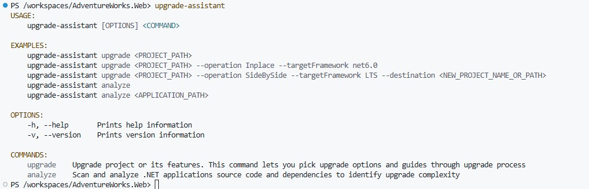

# Upgrade application
Once the codespace has initialized succesfuly
1. Open a PS terminal
2. Run the ```upgrade-assistant``` command to make sure the tool is intalled

3. Run the ```upgrade-assistant migrate``` command and follow the wizard steps to perform the upgrade.

4. Once the process finishes run ```dotnet build AdventureWorks.Web.csproj``` to build the solution.

    > **NOTE** The build will fail. A few manual steps are needed to compile  

    - **Changes at .csproj**

      Remove the nuget package references at the csproj file to only have

      ```
      <Project Sdk="Microsoft.NET.Sdk.Web">
        <PropertyGroup>
          <TargetFramework>net9.0</TargetFramework>
        </PropertyGroup>
        <ItemGrou>
          <PackageReference Include="Microsoft.EntityFrameworkCore.SqlServer" Version="9.0.0" />
          <PackageReference Include="Microsoft.VisualStudio.Web.CodeGeneration.Design" Version="9.0.0" />
        </ItemGroup>
      </Project>
      ```
    - **Changes at ``startup.cs``**
    
      Change signature of configure method to use ``IWebHostEnvironment`` instead of ``IHostingEnvironment`` which is obsolete.

      Add endpoint routing
    
      `` services.AddMvc(services => services.EnableEndpointRouting = false); ``

      Remove the compatibility mode.

      ``services.AddMvc().SetCompatibilityVersion(CompatibilityVersion.Version_2_1);``

      Remove httpsRedirection

      ``app.UseHttpsRedirection();``

    - **Changes at ``sampledbContext.cs``**

      Replace all instances of ``HasName()`` function with ``HasDatabaseName()``

5. Select ``startup.cs`` and go to the debug pane and create a ``launch.json`` file to start the application.

```json
{
    // Use IntelliSense to learn about possible attributes.
    // Hover to view descriptions of existing attributes.
    // For more information, visit: https://go.microsoft.com/fwlink/?linkid=830387
    "version": "0.2.0",
    "configurations": [
        {
            "name": ".NET Core Launch (web)",
            "type": "coreclr",
            "request": "launch",
            "preLaunchTask": "build",
            "program": "${workspaceFolder}/bin/Debug/net9.0/AdventureWorks.Web.dll",
            "args": [],
            "cwd": "${workspaceFolder}",
            "stopAtEntry": false,
            "serverReadyAction": {
                "action": "openExternally",
                "pattern": "\\bNow listening on:\\s+(https?://\\S+)"
            },
            "env": {
                "ASPNETCORE_ENVIRONMENT": "Development"
            },
            "sourceFileMap": {
                "/Views": "${workspaceFolder}/Views"
            }
        },
        {
            "name": ".NET Core Attach",
            "type": "coreclr",
            "request": "attach"
        }
    ]
}
```

you can now start the application in debug mode. GitHub will establish a tunnel to allow the communication of the browser with the codespace running the application.

>**NOTE** the application will crash (throw an exception) as no database connection string has been specified.
